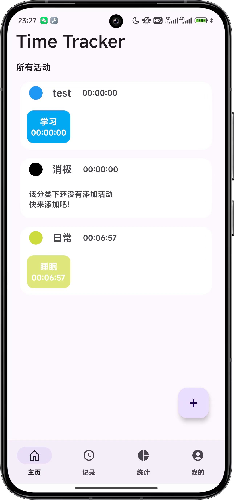
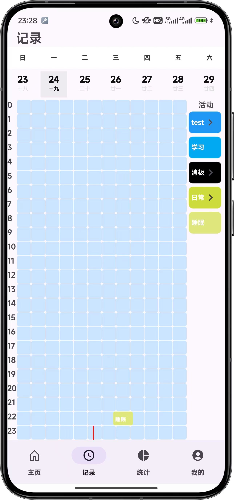
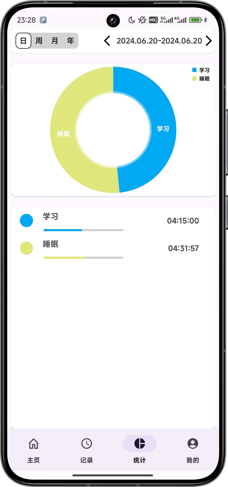

# Time_Tracker_Native

原生开发的一个事件记录工具，用于记录每天的事件，以及事件的开始时间和结束时间。

具有统计功能，开发ing...

## APP截图

|              首页              |              记录页              |                 统计                 |
| :----------------------------: | :------------------------------: | :----------------------------------: |
|  |  |  |
